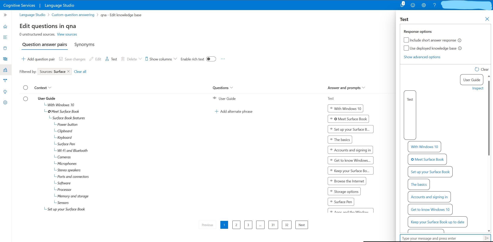

# Azure Bot - C# Custom Question Answering Sample with prompt support

* Custom question answering has feature to add prompts for follow up questions - [Guided Conversation with Muliturn prompts](https://learn.microsoft.com/en-us/azure/cognitive-services/language-service/question-answering/tutorials/guided-conversations). 
* 
* This sample is fork (as of 02nd Mar 2023) of [CustomQABot Sample](https://github.com/microsoft/BotBuilder-Samples/tree/main/samples/csharp_dotnetcore/12.customQABot) from Bot Builder Samples C# repository with additional functionality of showing suggested prompts returned by Custom QA.
* The sample uses [SuggestedActions](https://learn.microsoft.com/en-us/azure/bot-service/bot-builder-howto-add-suggested-actions?view=azure-bot-service-4.0&tabs=csharp) concept to show the [prompts](https://learn.microsoft.com/en-us/dotnet/api/microsoft.bot.builder.ai.qna.qnamakerprompt?view=botbuilder-dotnet-stable) returned by [QNAMaker.GetAnswersAsync](https://learn.microsoft.com/en-us/dotnet/api/microsoft.bot.builder.ai.qna.qnamaker.getanswersasync?view=botbuilder-dotnet-stable)
 


# Custom Question Answering

Bot Framework v4 Custom question answering bot sample.

This bot has been created using the [Bot Framework SDK][BF], it shows how to create a bot that uses [Cognitive Services' question answering feature][Quickstart].

[Question answering][LS] lets you to build, train and publish a simple question and answer bot based on FAQ URLs, structured and unstructured documents, or editorial content in minutes. In this sample, we demonstrate how to use question answering to answer questions based on an FAQ text file used as input.

## Prerequisites
- This project requires a [Language service resource](https://aka.ms/create-language-resource) with Custom question answering enabled.

### Configure knowledge base of the project
- See the [quickstart][Quickstart] to create a Custom question answering project. You will need this project's name to be used as `ProjectName` in [appsettings.json](appsettings.json).
- Go to [Language Studio][LS] and open the created project.
- Go to `Edit knowledge base` > `...` > `Import questions and answers` > `Import as TSV`.
- Import the [SampleForCQA.tsv](CognitiveModels/SampleForCQA.tsv) file.
- You can test your knowledge base by clicking on `Test` option.
- Go to `Deploy knowledge base` and click on `Deploy`.

### Connect your bot to the project
Follow these steps to update [appsettings.json](appsettings.json):
- In the [Azure Portal][Azure], go to your resource.
- Under Resource Management, go to `Keys and Endpoint`.
- Copy and paste the following values into their respective variables in [appsettings.json](appsettings.json):
     - One of the keys: `LanguageEndpointKey` 
     - Endpoint: `LanguageEndpointHostName`
- `ProjectName` is the name of the project created in [Language Studio][LS].

## Try this sample

- Install the Bot Framework Emulator version 4.14.0 or greater from [here][BFE]
- Clone the repository

    ```bash
    git clone https://github.com/Microsoft/botbuilder-samples.git
    ```

- In a terminal, navigate to `samples/csharp_dotnetcore/12.customQABot`
- Run the bot, either from a terminal or from Visual Studio, using the appropriate steps below:

  A) From a terminal

  ```bash
  # run the bot
  dotnet run
  ```

  B) Or from Visual Studio

  - Launch Visual Studio
  - File -> Open -> Project/Solution
  - Navigate to `samples/csharp_dotnetcore/12.customQABot` folder
  - Select `CustomQABot.csproj` file
  - Press `F5` to run the project
- Connect to the bot using Bot Framework Emulator
  1. Launch Bot Framework Emulator
  2. File -> Open Bot
  3. Enter a Bot URL of `http://localhost:3978/api/messages`

## Try precise answering
- Try the following utterances:
  1. Accessibility
  2. Register
- You should see a short answer returned, along with a long answer.
- If you're testing in [Language Studio][LS], you might have to check `Include short answer response` at the top.
- You can disable precise answering by setting `EnablePreciseAnswer` to false in [appsettings.json](appsettings.json).
- To only see precise answers in the response, set `DisplayPreciseAnswerOnly` to true in [appsettings.json](appsettings.json).
- To learn more, see [precise answering][PA].

## Deploy the bot to Azure
See [Deploy your C# bot to Azure][50] for instructions.

The deployment process assumes you have an account on Microsoft Azure and are able to log into the [Microsoft Azure Portal][Azure].

If you are new to Microsoft Azure, please refer to [Getting started with Azure][70] for guidance on how to get started on Azure.

## Further reading

- [How bots work](https://docs.microsoft.com/azure/bot-service/bot-builder-basics)
- [Question Answering Documentation](https://docs.microsoft.com/azure/cognitive-services/language-service/question-answering/overview)
- [Channels and Bot Connector Service](https://docs.microsoft.com/azure/bot-service/bot-concepts)

[50]: https://docs.microsoft.com/azure/bot-service/bot-builder-howto-deploy-azure
[70]: https://azure.microsoft.com/get-started/

[LS]: https://language.cognitive.azure.com/
[PA]: https://docs.microsoft.com/azure/cognitive-services/language-service/question-answering/concepts/precise-answering
[BF]: https://dev.botframework.com/
[Quickstart]: https://docs.microsoft.com/azure/cognitive-services/language-service/question-answering/quickstart/sdk
[Azure]: https://portal.azure.com
[BFE]: https://github.com/Microsoft/BotFramework-Emulator/releases